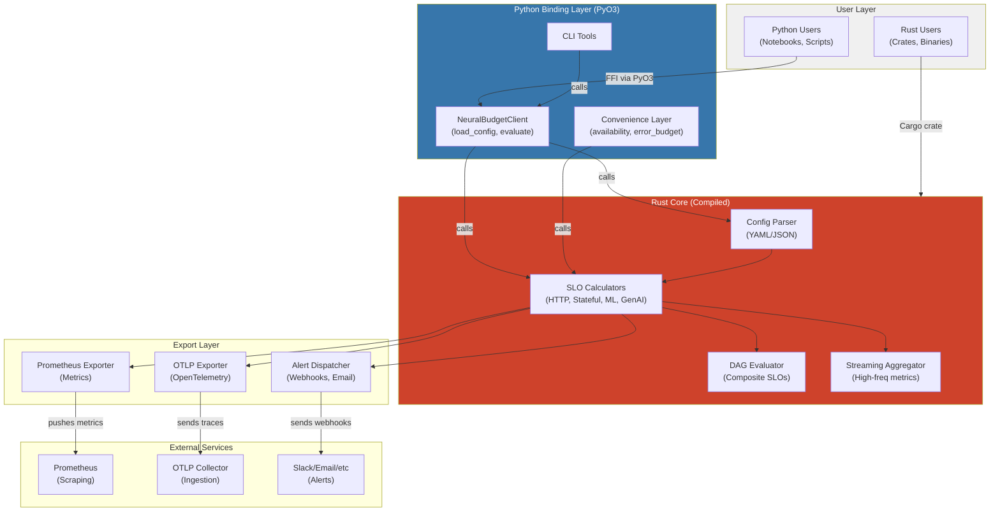
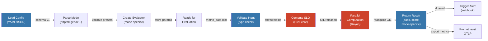
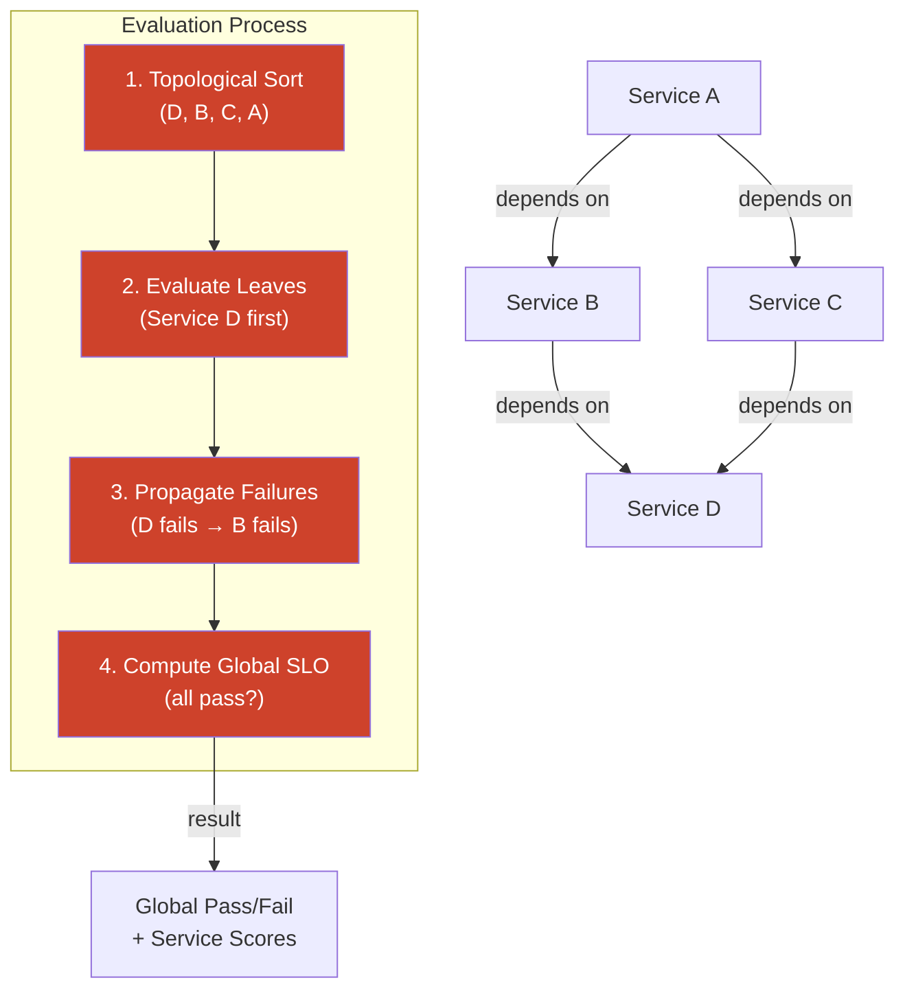
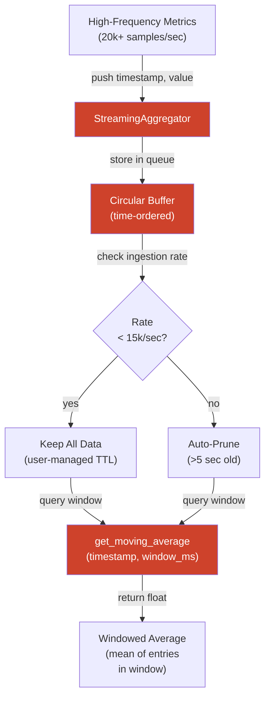

# Architecture & System Design

**Last Updated:** June 27, 2026

This guide explains NeuralBudget's architecture, design decisions, and how components interact.

---

## System Architecture Overview



**Key Design Principles:**
- **Single Source of Truth:** All calculation logic in Rust core
- **Minimal Python Wrapper:** Python layer is thin FFI binding
- **GIL Release During Compute:** `evaluate()` frees Python GIL for true parallelism
- **Type Safety Across Boundary:** Rust compile-time checks + Python runtime validation

---

## SLO Evaluation Flow



**Steps:**
1. **Load Config** — Parse YAML/JSON, extract mode and presets
2. **Validate** — Type check metrics, bounds check thresholds
3. **Evaluate** — Rust core computes pass/fail and score
4. **Return** — Python wrapper returns results as dict
5. **Action** — Export to Prometheus or dispatch alerts

---

## Composite SLO DAG Evaluation



**Evaluation Logic:**
- **No cycles allowed** — DAG structure enforced
- **Leaf services first** — Topological sort ensures dependencies evaluated before dependents
- **Failure propagation** — If B fails, A fails (dependency failed)
- **Global SLO** — True only if ALL services pass

---

## Streaming Aggregator Data Flow



**Memory Management:**
- **Normal Load:** (<15k/sec) — Keep data until `prune()` called or TTL expires
- **High Load:** (≥15k/sec) — Auto-remove data >5 seconds old; keep buffer <4 MB
- **Adaptive:** Automatic tuning; no configuration needed

---

## Module Responsibilities

### Core Rust Modules (`src/`)

| Module | Responsibility | Key Functions |
|--------|---|---|
| **core.rs** | SLO models and evaluation logic | `evaluate_http_slo()`, `calculate_availability()`, `calculate_error_budget()` |
| **slo_graph.rs** | Parallel metric batch evaluation | `ParallelMetricBatch::new()`, `evaluate()` (GIL release) |
| **streaming.rs** | High-frequency streaming aggregation | `StreamingAggregator::push()`, `get_moving_average()` |
| **exporter.rs** | Prometheus metrics rendering | `render_prometheus_text()`, `MetricsExporter` |
| **otlp.rs** | OpenTelemetry format conversion | `to_otlp_metric()`, `OtlpSerializer` |
| **python.rs** | PyO3 FFI bindings | `#[pyclass]`, `#[pymethods]` macros |
| **composite.rs** (planned) | DAG evaluation with failure propagation | `CompositeSloGraph` |

### Python Layer (`python/neuralbudget/`)

| Module | Responsibility |
|--------|---|
| **client.py** | `NeuralBudgetClient` — config loading, evaluation orchestration |
| **convenience.py** | High-level functions like `availability_snapshot()`, `error_budget_remaining()` |
| **alerting.py** | Alert dispatch (Slack, PagerDuty, webhooks) |
| **utils.py** | Helpers: config validation, result formatting |

---

## Type Safety Strategy

### Problem: How to Ensure Correctness at Rust-Python Boundary?

**Layers of Defense:**

```
Level 1: Rust Compile-Time Checks
  └─ Strong type system catches API mismatches
     (e.g., wrong return type, missing field)

Level 2: PyO3 FFI Contract
  └─ FFI signatures verified at compile time
     (e.g., `#[pyclass]`, `#[pymethods]`)

Level 3: Python Runtime Validation
  └─ TypedDict, runtime checks on dict structure
     (e.g., "metric_data must have 'timestamp' key")

Level 4: Schema Versioning
  └─ Config schema version prevents silent incompatibilities
     (e.g., v0.1.2 → v0.1.3 upgrade)
```

**Example:**

Rust:
```rust
#[pyclass]
pub struct NeuralBudgetClient {
    config: SloConfig,
}

#[pymethods]
impl NeuralBudgetClient {
    pub fn evaluate(&self, metric_data: &PyDict) -> PyResult<PyDict> {
        // Type-checked at compile time
        // Validated at runtime
    }
}
```

Python:
```python
from typing_extensions import TypedDict

class MetricData(TypedDict):
    timestamp: int
    success: int
    total: int
    buckets: list
    format: str

# Runtime validation
def validate_metric_data(data: dict) -> MetricData:
    required = ["timestamp", "success", "total"]
    for key in required:
        if key not in data:
            raise ValueError(f"Missing required field: {key}")
    return data
```

---

## Performance Characteristics

### SLO Evaluation Latency

| Operation | Latency | Throughput | Notes |
|---|---|---|---|
| `evaluate()` single metric | <1 μs | >1M metrics/sec | GIL released; true parallelism |
| Evaluate 1,000 metrics | 10-50 μs | 50k-100k batch/sec | Rayon work-stealing parallelism |
| Composite DAG (50 services) | 10-100 μs | 10k-100k DAG/sec | Topological sort + failure prop. |

### Memory Footprint

| Component | Memory | Scaling |
|---|---|---|
| NeuralBudgetClient (per instance) | ~10 KB | O(1) |
| ParallelMetricBatch (1k metrics) | ~50 KB | O(n) — linear with metric count |
| StreamingAggregator (active) | <4 MB | O(1) — capped by auto-pruning |
| DAG evaluator (50 services) | ~20 KB | O(n log n) — topological sort |

### GIL Release Benefit

**Without GIL release** (Python-only):
```
1 thread evaluates 1,000 metrics sequentially
Time: 1,000 μs = 1 ms
Throughput: 1,000 metrics/sec
```

**With GIL release** (NeuralBudget):
```
1 Python thread → releases GIL → Rust evaluates on 8 CPU cores
Time: ~100 μs (1,000 μs / ~10 parallel factor)
Throughput: 10,000+ metrics/sec
Python can process other requests while evaluation happens
```

---

## Design Trade-offs

### 1. Rust-First Core vs. Pure Python

| Aspect | Rust-First | Pure Python |
|---|---|---|
| **Performance** | 100-1000x faster | 1x (baseline) |
| **Memory** | Fixed overhead | Varies with load |
| **Correctness** | Compile-time checks | Runtime errors |
| **Development** | Slower to iterate | Faster iteration |
| **Learning curve** | Steep (Rust + PyO3) | Gentle (Python) |

**Decision:** Rust-first because:
- SLO calculations must be fast (sub-millisecond latency)
- Type safety is critical for reliability
- Single source of truth eliminates bugs across implementations

---

### 2. Centralized Config File vs. Inline Parameters

| Aspect | Config File | Inline |
|---|---|---|
| **Auditability** | ✅ Version controlled | ❌ Hidden in code |
| **Reproducibility** | ✅ Same config same results | ❌ Code changes affect results |
| **Flexibility** | ✅ Change without rebuild | ❌ Requires code change |
| **Validation** | ✅ Schema enforced | ❌ No validation |

**Decision:** Centralized config because:
- SLO policies must be reviewable and auditable
- Schema versioning prevents incompatibilities
- Non-engineers can modify SLOs

---

### 3. ParallelMetricBatch vs. CompositeSloGraph

| Feature | ParallelMetricBatch | CompositeSloGraph |
|---|---|---|
| **Model** | Independent metrics | Dependency DAG |
| **Failure propagation** | None | ✅ Models failures across edges |
| **Use case** | Single service | Multi-service |
| **Latency** | <1 μs per metric | 10-100 μs per DAG |

**Decision:** Both because:
- Most users have single-service SLOs (ParallelMetricBatch)
- Complex deployments need dependency modeling (CompositeSloGraph)
- Each is optimized for its use case

---

## Why Rust-First Architecture?

### Problem: Reproducibility Across Environments

**Challenge:** SLO calculations must be identical in:
- CI/CD pipelines
- Production sidecars
- Analytics notebooks

**Solution:** Rust guarantees determinism:
- No GC pauses → no timing variation
- No JIT compilation → no runtime variation
- No floating-point rounding differences

**Benefit:** Same metric always produces same result

---

### Problem: Bridging Data Science and Systems Engineering

**Challenge:** Data scientists need notebooks (Python); infrastructure teams need compiled reliability

**Solution:** Rust core + Python bindings
- Data scientists use Python interface (ergonomic)
- Infrastructure teams use compiled crate (performance)
- Both get Rust's correctness guarantees

**Benefit:** One tool, two audiences

---

### Problem: Performance at Scale

**Challenge:** Evaluating composite DAGs can be expensive:
- 50 services = 50 pass/fail evaluations + topological sort + failure propagation
- In CI/CD, need sub-millisecond latency
- In notebooks, need sub-second for interactive exploration

**Solution:** Rust zero-cost abstractions
- Topological sort: O(n log n) in Rust vs. O(n²) in Python
- Parallel evaluation: 8+ cores vs. 1 core (Python GIL)
- No wrapper overhead

**Benefit:** Feasible to evaluate thousands of SLOs in seconds

---

## Future Roadmap

### Phase 3 (Current)
- ✅ Streaming aggregator with adaptive windowing
- ✅ Parallel metric batch evaluation (Phase 3)
- ✅ GenAI and ML workload SLOs
- ✅ Anomaly detection (statistical)

### Phase 4 (Planned)
- 🔄 CompositeSloGraph DAG evaluation
- 🔄 Python async/await support
- 🔄 Distributed SLO computation

### Phase 5 (Future)
- 🔄 WebAssembly (WASM) compilation for edge evaluation
- 🔄 GPU-accelerated burn rate forecasting
- 🔄 Real-time SLO optimization

---

## Glossary for This Document

- **GIL** — Global Interpreter Lock; Python's thread synchronization
- **DAG** — Directed Acyclic Graph; service dependency model
- **Rayon** — Rust data parallelism library using work-stealing
- **PyO3** — Rust library enabling Python bindings
- **OTLP** — OpenTelemetry Protocol; standard metrics format
- **Topological Sort** — Ordering ensuring all dependencies precede dependents

---

## See Also

- [API Reference](api.md) — Complete function signatures
- [Glossary](glossary.md) — Term definitions
- [Getting Started](../guides/getting-started.md) — Quick tutorial
- [User Guide](../guides/user-guide.md) — Feature guide
